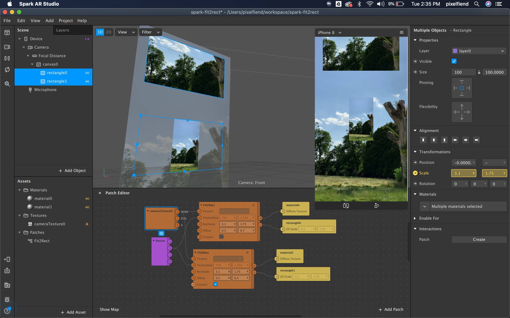

## Fit textures into rectangles in Spark AR

This utility patch will make your texture cover the entire rectangle, without any distortion. You can also set the pivot point to control the alignment of the texture. See the demo video for more information.

Update: there is now an option to contain the texture to the rect instead of filling

[Demo on YouTube](https://youtu.be/tX2uyytflM4)

## Resources

Learn more stuff by watching my [Spark AR Tutorials on YouTube!](https://www.youtube.com/playlist?list=PLAZp2Vi7Gfspzyla4RrCO6BzVzYW7Lnb-)

Follow me on Instagram [@positlabs](https://instagram.com/positlabs) and try out my effects!

Browse my open-source [Spark AR repositories on Github!](https://github.com/search?q=user%3Apositlabs+spark)

Have questions? Join the [Spark AR Community](https://www.facebook.com/groups/SparkARcommunity/) group on Facebook.

## Donations

If you used this in client projects, or simply enjoyed making effects with my open-source projects, please consider a donation or sponsorship. One-time donations can be made with PayPal. Subscriptions can be through PayPal or [Github Sponsorships](https://github.com/sponsors/positlabs).

